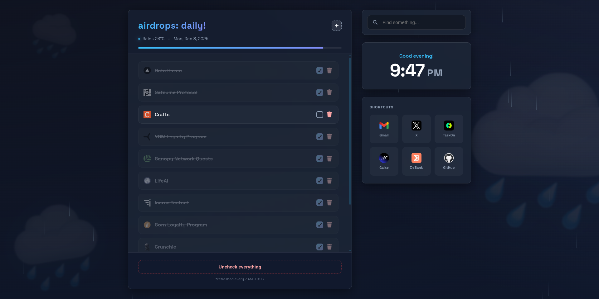

# My Chrome Homepage 🏠

Personal browser homepage for tracking daily airdrops. Clean, simple, syncs across devices.



## Features

- ⏰ Clock with contextual greeting (Good morning/afternoon/evening)
- ✅ Daily task tracker (auto-resets at 7 AM)
- 🔍 Quick search (powered by Brave)
- 🚀 Shortcut grid to your favorite platforms
- ☁️ Real-time sync via Firebase Firestore

## Setup

This homepage is pure static HTML + Firebase. No installation needed:

1. **Clone the repo**
   ```
   git clone https://github.com/tatan100/Homepage.git
   ```

2. **Setup Firebase** (free!)
   - Create a project at [Firebase Console](https://console.firebase.google.com)
   - Enable Firestore Database
   - Copy the config to `index.html`
   - Set up Security Rules (so only you can edit)

3. **Deploy to GitHub Pages**
   - Push to GitHub
   - Settings → Pages → Deploy from main branch
   - Done! ✨

## File Structure

```
index.html      → Main page + Firebase config
css/style.css   → Glassmorphism styling
js/script.js    → Logic + Firebase integration
fonts/          → Font Awesome 7 (for icons)
assets/         → Preview screenshot
```

## Usage

- **Add task:** Click the `+` button in the top-right
- **Check task:** Click checkbox (auto-saves to Firebase)
- **Delete task:** Click the 🗑️ icon
- **Search:** Type in the search bar, hit Enter
- **Shortcuts:** Just click them
- **Reset tasks:** Auto-resets at 7 AM, or click "Uncheck everything"

## Tech Stack

- Pure JavaScript (ES6 modules)
- Firebase Firestore (cloud storage)
- GitHub Pages (hosting)
- localStorage (fallback when Firebase errors)

---

Built for tracking daily crypto airdrops 🪂  
Made with 🩵 and ☕
